<!--
SPDX-FileCopyrightText: 2025 2025 INDUSTRIA DE DISEÑO TEXTIL S.A. (INDITEX S.A.)
SPDX-FileContributor: enriqueavi@inditex.com

SPDX-License-Identifier: CC-BY-4.0
-->

<div align="center">

# 🚀 k8s-overcommit Operator

**Intelligent resource overcommit management for Kubernetes clusters**

[](LICENSE)
[](https://github.com/InditexTech/k8s-overcommit-operator/releases)
[](go.mod)
[](https://github.com/InditexTech/k8s-overcommit-operator/actions)

[](https://kubernetes.io/)
[](https://sdk.operatorframework.io/)
[](https://golang.org/)
[](https://helm.sh/)
[](https://reuse.software/)

[](https://github.com/InditexTech/k8s-overcommit-operator/issues)
[](https://github.com/InditexTech/k8s-overcommit-operator/pulls)
[](https://github.com/InditexTech/k8s-overcommit-operator/stargazers)
[](https://github.com/InditexTech/k8s-overcommit-operator/network/members)

[🚀 Quick Start](#-quick-start) • [📖 Documentation](./docs) • [🤝 Contributing](./CONTRIBUTING.md) • [📝 License](./LICENSE)


</div>

---

## 🎯 Overview

The **k8s-overcommit Operator** is a Kubernetes operator designed to intelligently manage resource overcommit on pod resource requests. It automatically adjusts CPU and memory requests based on configurable overcommit classes, enabling better cluster resource utilization while maintaining workload performance.

### ✨ Key Features

- 🎛️ **Flexible Overcommit Classes**: Define different overcommit policies for different workload types
- 🏷️ **Label-Based Configuration**: Apply overcommit using pod or namespace labels
- 🛡️ **Namespace Exclusions**: Protect critical namespaces from overcommit policies
- 📊 **Default Policies**: Fallback overcommit values when no specific class is defined
- 🔒 **Admission Webhooks**: Seamless integration with Kubernetes admission controllers
- 📈 **Resource Optimization**: Improve cluster resource utilization efficiency

---

## 🚀 Quick Start

### 🎯 Method 1: Helm Installation (Recommended)

#### 1️⃣ Clone the Repository

Clone the repository to your local machine:

```bash
git clone https://github.com/InditexTech/k8s-overcommit-operator.git
cd k8s-overcommit-operator
```

#### 2️⃣ Configure Values

Edit the [`values.yaml`](../chart/values.yaml) file to customize your deployment. Below is an example configuration:

```yaml
# Example configuration
deployment:
  image:
    registry: ghcr.io
    image: inditextech/k8s-overcommit-operator
    tag: 1.0.0
```

#### 3️⃣ Install with Helm

Install the operator using Helm:

```bash
helm install k8s-overcommit-operator chart
```

### 🔧 Method 2: OLM Installation

#### 1️⃣ Install the CatalogSource

For OpenShift or clusters with OLM installed, apply the catalog source:

```bash
kubectl apply -f https://raw.githubusercontent.com/InditexTech/k8s-overcommit-operator/refs/heads/main/deploy/catalog_source.yaml
```

#### 2️⃣ Apply the OperatorGroup

Apply the operator group configuration:

```bash
kubectl apply -f https://raw.githubusercontent.com/InditexTech/k8s-overcommit-operator/refs/heads/main/deploy/operator_group.yaml
```

#### 3️⃣ Create the Subscription (Alternative)

You can create your own subscription or use the default [`subscription.yaml`](../deploy/subscription.yaml). Below is an example:

```yaml
apiVersion: operators.coreos.com/v1alpha1
kind: Subscription
metadata:
  name: k8s-overcommit-operator
  namespace: operators
spec:
  channel: alpha
  name: k8s-overcommit-operator
  source: community-operators
  sourceNamespace: olm
```

Apply the subscription:

```bash
kubectl apply -f https://raw.githubusercontent.com/InditexTech/k8s-overcommit-operator/refs/heads/main/deploy/subscription.yaml
```

#### 4️⃣ Validation

After installation, validate that the operator is running:

```bash
kubectl get pods -n k8s-overcommit
```


## 📝 Configuration

### 🎯 Overcommit Resource

> [!IMPORTANT]
> **It's a singleton CRD**: only can exist one, and it has to be called **cluster**

First, deploy the main `Overcommit` resource named **"cluster"**:

```yaml
apiVersion: overcommit.inditex.dev/v1alpha1
kind: Overcommit
metadata:
  name: cluster
spec:
  overcommitLabel: inditex.com/overcommit-class
  labels:
    environment: production
  annotations:
    description: "Main overcommit configuration"
```

### 🏷️ OvercommitClass Resource

Define overcommit classes for different workload types:

```yaml
apiVersion: overcommit.inditex.dev/v1alpha1
kind: OvercommitClass
metadata:
  name: high
spec:
  cpuOvercommit: 0.2        # 20% of limits as requests
  memoryOvercommit: 0.8     # 80% of limits as requests
  excludedNamespaces: ".*(^(openshift|k8s-overcommit|kube).*).*"
  isDefault: true
  labels:
    workload-type: batch
  annotations:
    description: "High-density workloads with aggressive overcommit"
```

---

## 💡 How It Works

### 🔍 Label Resolution Priority

1. **Pod Level**: Check if pod has the overcommit class label
2. **Namespace Level**: If not found, check namespace labels
3. **Default Class**: Apply default overcommit class if configured

### 📊 Calculation Example

**Original Pod Specification:**
```yaml
apiVersion: v1
kind: Pod
metadata:
  name: test
  labels:
    inditex.com/overcommit-class: high
spec:
  resources:
    limits:
      cpu: "2"
      memory: "2Gi"
```

**With OvercommitClass (cpuOvercommit: 0.2, memoryOvercommit: 0.8):**
```yaml
apiVersion: v1
kind: Pod
metadata:
  name: test
  labels:
    inditex.com/overcommit-class: high
spec:
  resources:
    limits:
      cpu: "2"           # Unchanged
      memory: "2Gi"      # Unchanged
    requests:
      cpu: "400m"        # 2 * 0.2 = 0.4 cores
      memory: "1638Mi"   # 2Gi * 0.8 = 1.6GiB
```

### 🛡️ Namespace Exclusions

Protect critical namespaces using regex patterns:

```yaml
excludedNamespaces: ".*(^(openshift|k8s-overcommit|kube).*).*"
```

This excludes:
- `openshift-*`
- `k8s-overcommit-*`
- `kube-*`

---

## 📚 Documentation

| Topic | Description | Link |
|-------|-------------|------|
| 🏗️ Architecture | Detailed architecture overview | [Architecture Guide](./docs/architecture.md) |
| 🧪 E2E Testing | End-to-end testing guide | [E2E Testing](./docs/e2e-test.md) |
| 🎯 Helm Configuration | Helm chart configuration options | [Helm Values](./chart/values.yaml) |
| 🤝 Contributing | How to contribute to the project | [Contributing Guide](./CONTRIBUTING.md) |
| 📋 Code of Conduct | Community guidelines | [Code of Conduct](./CODE_OF_CONDUCT.md) |

---

## 🤝 Contributing

We welcome contributions! Please see our [Contributing Guide](./CONTRIBUTING.md) for details on how to:

- 🐛 Report bugs
- 💡 Request features
- 🔧 Submit pull requests
- 📝 Improve documentation

### 🚀 Development Quick Start

```bash
# Generate the manifests
make generate manifests

# Install the CRDs
make install

# Run locally
make run

# Run tests
make test

# Build image
make docker-build
```

### 🚀 Develop with Tilt

Tilt is a tool that streamlines Kubernetes development by automating build, deploy, and live-update workflows.

```bash
./hack/tilt/run_tilt.sh
```

---

## 📄 License

This project is licensed under the **Apache License 2.0** - see the [LICENSE](./LICENSE) file for details.

---

## 🙏 Acknowledgments

- Built with ❤️ by the [Inditex Tech](https://github.com/InditexTech) team
- Powered by [Operator SDK](https://sdk.operatorframework.io/)
- Inspired by Kubernetes community best practices

---

<div align="center">

**[⭐ Star this project](https://github.com/InditexTech/k8s-overcommit-operator) if you find it useful!**

Made with ❤️ for the Kubernetes community

</div>

---

## 🏗️ Architecture

<div align="center">


</div>

### 🔄 Kubernetes API Flow

```mermaid
flowchart LR
    subgraph "Main Flow"
    A[📝 API Request] --> B[🔧 API HTTP Handler]
    B --> C[🔐 Authentication & Authorization]
    C --> D[🔄 Mutating Admission]
    D --> E[✅ Object Schema Validation]
    E --> F[🛡️ Validating Admission]
    F --> G[💾 Persisted to etcd]
    end

    subgraph "Mutating Webhooks"
    direction LR
    D --> MW1[🔄 Overcommit Webhook]
    D --> MW2[🔄 Other Webhooks]
    end

    subgraph "Validating Webhooks"
    direction LR
    F --> VW1[✅ Validation Webhook 1]
    F --> VW2[✅ Validation Webhook 2]
    F --> VW3[✅ Validation Webhook 3]
    end
```



<div align="center">

**[⬆️ Back to Top](#-k8s-overcommit-operator)**

</div>
