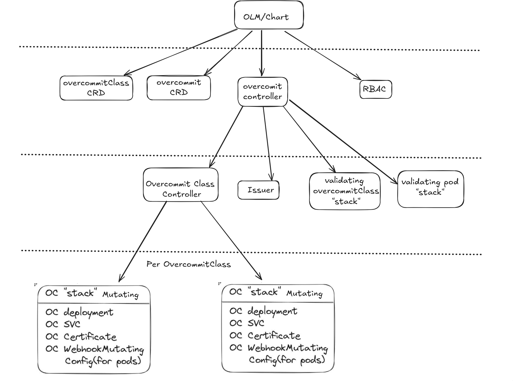
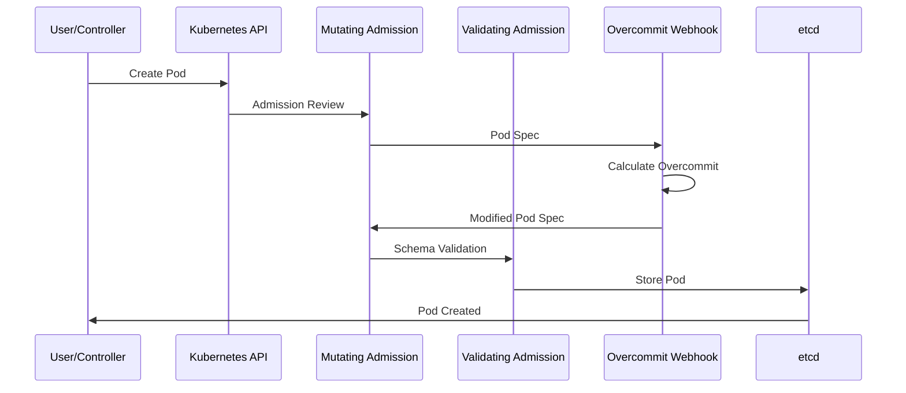
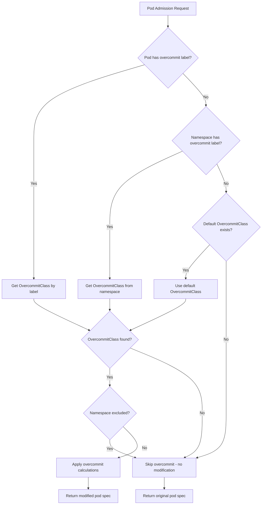
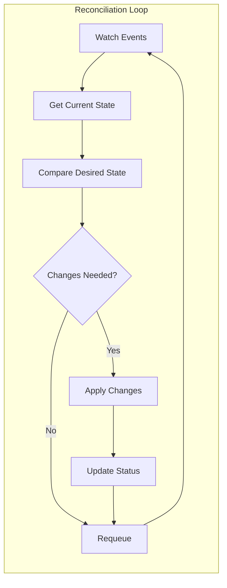

<!--
SPDX-FileCopyrightText: 2025 2025 INDUSTRIA DE DISEÑO TEXTIL S.A. (INDITEX S.A.)
SPDX-FileContributor: enriqueavi@inditex.com

SPDX-License-Identifier: CC-BY-4.0
-->

# 🏗️ Architecture Documentation

## 📋 Table of Contents

- [Overview](#-overview)
- [System Components](#-system-components)
- [Kubernetes API Flow](#-kubernetes-api-flow)
- [Custom Resources](#-custom-resources)
- [Admission Webhooks](#-admission-webhooks)
- [Controller Logic](#-controller-logic)
- [Resource Management](#-resource-management)
- [Security Model](#-security-model)

---

## 🎯 Overview

The **k8s-overcommit Operator** is a Kubernetes-native operator designed to intelligently manage resource overcommit on pod resource requests. It leverages the Kubernetes admission control mechanism to dynamically adjust CPU and memory requests based on configurable overcommit classes.

### 🎨 Design Principles

- **🔧 Declarative Configuration**: Uses Custom Resources to define overcommit policies
- **🏷️ Label-based Selection**: Applies policies based on pod and namespace labels
- **🛡️ Non-intrusive**: Modifies only resource requests, preserving limits
- **🔒 Secure by Default**: Excludes critical namespaces automatically
- **📊 Observable**: Provides metrics and logging for monitoring

---

## 🧩 System Components

### Core Components



### Component Descriptions

| Component | Purpose | Location |
|-----------|---------|----------|
| **Overcommit Controller** | Manages main Overcommit resource and deploys OvercommitClass controllers | [`internal/controller/overcommitclass/`](../internal/controller/overcommitclass/) |
| **OvercommitClass Controller** | Watches OvercommitClass resources and configures webhooks | [`internal/resources/generate_resources_overcommit_class_controller_controller.go`](../internal/resources/generate_resources_overcommit_class_controller_controller.go) |
| **Pod Mutating Webhook** | Modifies pod resource requests based on overcommit policies | [`api/v1alpha1/overcommitclass_webhook.go`](../internal/webhook/v1alphav1/mutating/pod_webhook.go) |
| **OvercommitClass Validating Webhook** | Validates OvercommitClass resource specifications | [`internal/webhook/v1alphav1/mutating/pod_webhook.go`](../api/v1alpha1/overcommitclass_webhook.go) |
| **Pod Validating Webhook** | Validates Pod With Unexisting Class | [`internal/webhook/v1alphav1/validating/pod_webhook.go`](../internal/webhook/v1alphav1/validating/pod_webhook.go) |
| **Certificate Manager** | Generates and manages TLS certificates for webhooks | [`internal/resources/generate_issuer.go`](../internal/resources/generate_issuer.go) |

---

## 🔄 Kubernetes API Flow

### Pod Creation Flow



### Webhook Decision Logic



---

## 📦 Custom Resources

### Overcommit Resource

> [!IMPORTANT]
> **It's a singleton CRD**: only can exist one, and it has to be called **cluster**

The main configuration resource that enables the operator:

```yaml
apiVersion: overcommit.inditex.dev/v1alpha1
kind: Overcommit
metadata:
  name: cluster
spec:
  overcommitLabel: "inditex.com/overcommit-class"
  labels:
    environment: "production"
  annotations:
    description: "Main overcommit configuration"
```

**Key Fields:**

- `overcommitLabel`: Label key used to identify overcommit class on pods/namespaces
- `labels`: Labels applied to generated resources
- `annotations`: Annotations applied to generated resources

### OvercommitClass Resource

Defines overcommit policies for different workload types:

```yaml
apiVersion: overcommit.inditex.dev/v1alpha1
kind: OvercommitClass
metadata:
  name: high-density
spec:
  cpuOvercommit: 0.2
  memoryOvercommit: 0.8
  isDefault: true
  excludedNamespaces: ".*(^(openshift|k8s-overcommit|kube).*).*"
  labels:
    example: "label"
  annotations:
    description: "High-density workloads"
```

**Key Fields:**

- `cpuOvercommit`: Ratio of CPU requests to limits (0.0-1.0)
- `memoryOvercommit`: Ratio of memory requests to limits (0.0-1.0)
- `isDefault`: Whether this class is used when no specific class is found
- `excludedNamespaces`: Regex pattern for namespaces to exclude
- `labels`: Labels applied to generated resources
- `annotations`: Annotations applied to generated resources

---

## 🔗 Admission Webhooks

### Mutating Webhook Configuration

```yaml
apiVersion: admissionregistration.k8s.io/v1
kind: MutatingAdmissionWebhook
metadata:
  name: overcommit-mutating-webhook
webhooks:
- name: pod-overcommit.overcommit.inditex.dev
  clientConfig:
    service:
      name: webhook-service
      namespace: k8s-overcommit-operator-system
      path: /mutate
  rules:
  - operations: ["CREATE", "UPDATE"]
    apiGroups: [""]
    apiVersions: ["v1"]
    resources: ["pods"]
```

### Webhook Logic Implementation

The webhook implementation in [`api/v1alpha1/overcommitclass_webhook.go`](../api/v1alpha1/overcommitclass_webhook.go) follows this logic:

1. **Label Resolution**: Check pod → namespace → default class
2. **Namespace Exclusion**: Apply regex patterns to exclude critical namespaces
3. **Calculation**: Apply overcommit ratios to resource limits
4. **Validation**: Ensure calculations are within valid ranges

---

## 🎮 Controller Logic

### Overcommit Controller

Located in [`internal/controller/overcommitclass/`](../internal/controller/overcommitclass/), manages:

- **Main Overcommit Resource**: Watches for cluster-wide configuration
- **Dynamic Deployment**: Creates OvercommitClass controllers on demand
- **Resource Cleanup**: Removes controllers when Overcommit is deleted

### Reconciliation Loop



### Generated Resources

The operator generates several Kubernetes resources:

| Resource Type | Purpose | Generated By |
|---------------|---------|--------------|
| **Deployment** | Runs the OvercommitClass controller | [`generate_resources_overcommit_class_controller_controller.go`](../internal/resources/generate_resources_overcommit_class_controller_controller.go) |
| **Service** | Exposes webhook endpoints | Controller logic |
| **Issuer** | Manages TLS certificates | [`generate_issuer.go`](../internal/resources/generate_issuer.go) |
| **Certificate** | TLS certs for webhooks | cert-manager |
| **MutatingAdmissionWebhook** | Webhook configuration | Controller logic |

---

## 📊 Resource Management

### Overcommit Calculation

The core calculation logic is implemented in [`pkg/overcommit/`](../pkg/overcommit/):

```go
// Example calculation
func CalculateResources(limits corev1.ResourceList, class OvercommitClass) corev1.ResourceList {
    requests := corev1.ResourceList{}

    if cpu, ok := limits[corev1.ResourceCPU]; ok {
        cpuRequest := cpu.DeepCopy()
        cpuRequest.SetScaled(cpuRequest.ScaledValue(resource.Milli) * int64(class.Spec.CPUOvercommit * 1000), resource.Milli)
        requests[corev1.ResourceCPU] = cpuRequest
    }

    if memory, ok := limits[corev1.ResourceMemory]; ok {
        memoryRequest := memory.DeepCopy()
        memoryRequest.SetScaled(memoryRequest.Value() * int64(class.Spec.MemoryOvercommit), resource.BinarySI)
        requests[corev1.ResourceMemory] = memoryRequest
    }

    return requests
}
```

### Resource Validation

- **Range Validation**: Overcommit ratios must be between 0.0 and 1.0
- **Resource Presence**: Only applies to pods with resource limits
- **Namespace Exclusion**: Regex-based exclusion of critical namespaces

---

## 🔒 Security Model

### RBAC Permissions

The operator requires minimal permissions:

```yaml
apiVersion: rbac.authorization.k8s.io/v1
kind: ClusterRole
metadata:
  name: manager-role
rules:
- apiGroups: [""]
  resources: ["pods"]
  verbs: ["get", "list", "watch"]
- apiGroups: ["overcommit.inditex.dev"]
  resources: ["overcommits", "overcommitclasses"]
  verbs: ["get", "list", "watch", "create", "update", "patch", "delete"]
```

### Certificate Management

- **cert-manager Integration**: Automatic TLS certificate generation
- **Self-signed Issuer**: Uses self-signed certificates for internal communication
- **Automatic Rotation**: Certificates are automatically renewed

### Namespace Isolation

- **Critical Namespace Protection**: Excludes system namespaces by default
- **Configurable Exclusions**: Regex-based exclusion patterns
- **Fail-safe Design**: Defaults to no modification if configuration is invalid

---

## 📈 Monitoring and Observability

### Metrics

The operator exposes Prometheus metrics on port 8080:

- `overcommit_pods_modified_total`: Total number of pods modified
- `overcommit_class_applications_total`: Total applications of each class
- `overcommit_webhook_duration_seconds`: Webhook processing time

### Logging

Structured logging with configurable levels:

```bash
# Enable debug logging
make run ARGS="--zap-log-level=debug"
```

### Health Checks

- **Readiness Probe**: Webhook endpoint health
- **Liveness Probe**: Controller manager health
- **Metrics Endpoint**: Prometheus scraping endpoint

---

## 🔧 Configuration Examples

### Development Environment

```yaml
apiVersion: overcommit.inditex.dev/v1alpha1
kind: OvercommitClass
metadata:
  name: development
spec:
  cpuOvercommit: 0.1     # Very conservative
  memoryOvercommit: 0.9  # Allow high memory usage
  isDefault: true
  excludedNamespaces: ".*(kube|openshift).*"
```

### Production Environment

```yaml
apiVersion: overcommit.inditex.dev/v1alpha1
kind: OvercommitClass
metadata:
  name: production
spec:
  cpuOvercommit: 0.5     # Balanced approach
  memoryOvercommit: 0.8  # Conservative memory
  isDefault: true
  excludedNamespaces: ".*(kube|openshift|istio|monitoring).*"
```

---

## 📚 References

- [Kubernetes Admission Controllers](https://kubernetes.io/docs/reference/access-authn-authz/admission-controllers/)
- [Operator Pattern](https://kubernetes.io/docs/concepts/extend-kubernetes/operator/)
- [Custom Resource Definitions](https://kubernetes.io/docs/concepts/extend-kubernetes/api-extension/custom-resources/)
- [cert-manager Documentation](https://cert-manager.io/docs/)
- [Operator SDK](https://sdk.operatorframework.io/docs/)

---

<div align="center">

**[⬆️ Back to Top](#-architecture-documentation)**

</div>
